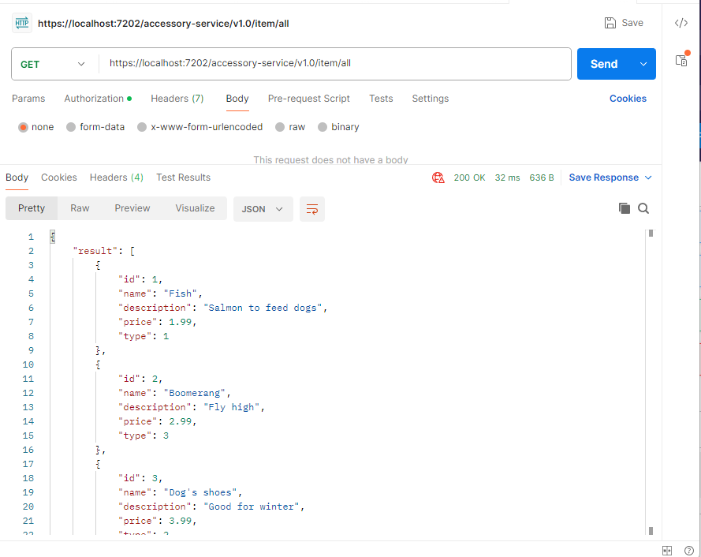

## Simple demo application to show an idea how to implement authentication/authorization in microservices architecture using api gateway. 

### This application focus on back-end architecture and can be used with a front-end application to explore more authentication/authorization topics.

### Description
The project consists of four microservices:  
ApiGateway - the purpose of the project. Api gateway which deals with proper routing the requests and their security, 
AuthService - microservice which delivers tools necessary for authentication/authorization, 
UserService - microservice which deals with user-related topics like creating new account or managing user details in database, 
AccessoryService - microservice which deals with accessory-related topics like getting list of items that can be bought online. 

The purpose of the implementation is to send requests to ApiGateway that will communicate with AuthService and UserService.

I used Yarp library to create ApiGateway: https://github.com/microsoft/reverse-proxy.

### Examples
How it works? ApiGateway should transform requests for specified microservices.

#### AuthService:
Request `https://localhost:7202/auth-service/v1.0/auth/secret` sent to ApiGateway will be forwarded to AuthService as `https://localhost:7170/api/v1.0/auth/secret`.

#### UserService:
Request `https://localhost:7202/user-service/v1.0/user/delete` sent to ApiGateway will be forwarded to UserService as `https://localhost:7193/api/v1.0/user/delete`.

### Running and testing the application
1. Clone the repository.
1. Unzip downloaded repository.
1. Open the repository in Visual Studio 2022.
1. Set multiple startup projects and choose all microservices. 
1. Press "Start" in Visual Studio 2022 to run the application.
1. Use Postman to send requests to ApiGateway microservices and test application behaviour.  
Sample requests: 

